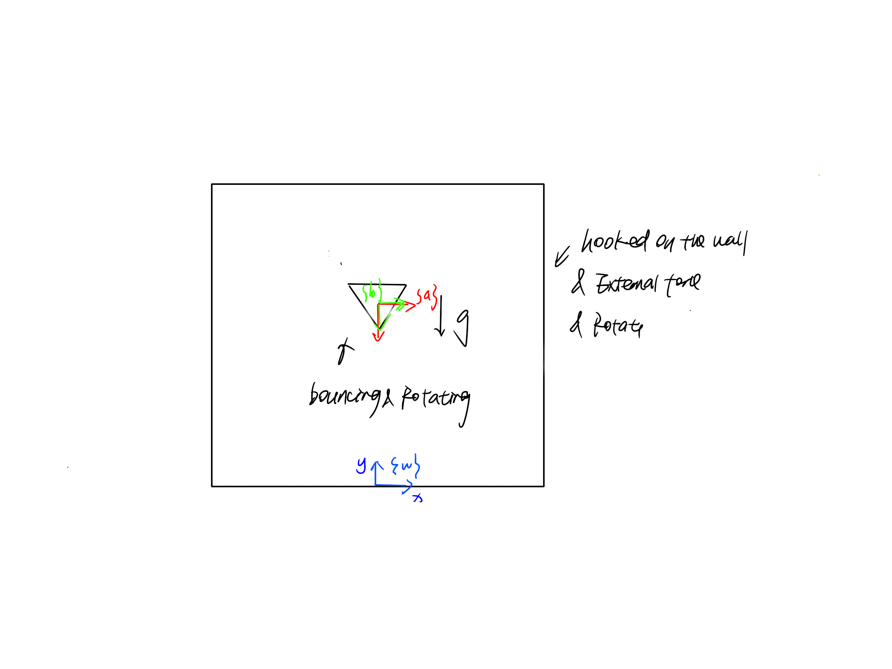

# Simulation of pin-triangle system
## Project Description
#### Inspired by classic pinball game, this project was originally designed to animate the dynamics of a 2D triangle bouncing in an enclosure spinning square. Since I did the impact update manually and there's too much impact```(12)```, I then changed to animate only two impacts and keep track of the dynamics of the system after this two impacts in 10 seconds.



The pictured pin-triangle is a constrained system involving 2 bodies: a equilateral triangle and a square. the triangle has length ```d = 3```, mass ```m =0.5``` and rotational inertia ```J=1``` (assuming that the center of mass is at the center of geometry). The square has length ```D = 20```, mass``` M = 5``` and rotational inertia ```J=3``` (assuming that the center of mass is at the center of geometry). The triangle has configuration ```(x,y,\theta_t)``` and the square has an angle ```\theta_s``` relative to the world frame. The triangle is constrainted to not bounce out of the square.

The initial condition is: 
```
(x,y,\theta_t,\theta_s)=(0,10,0,0)
```

The desired condition of the square is:
```
\theta_s^d(t) = \frac{\pi}{12}\sin\left(\frac{t}{2}\right) 
```
The external force applied at the joint $\theta_s$ is :
```
\begin{align*}F_{\theta_S}&=k(\theta_s^d-\theta_s)\end{align*} 
```

The simulation is from ```t=0``` until ```t=5.5``` with ```dt=0.01```, assuming the control constant is ```k=10```.

The demo of the simulation is shown below:

